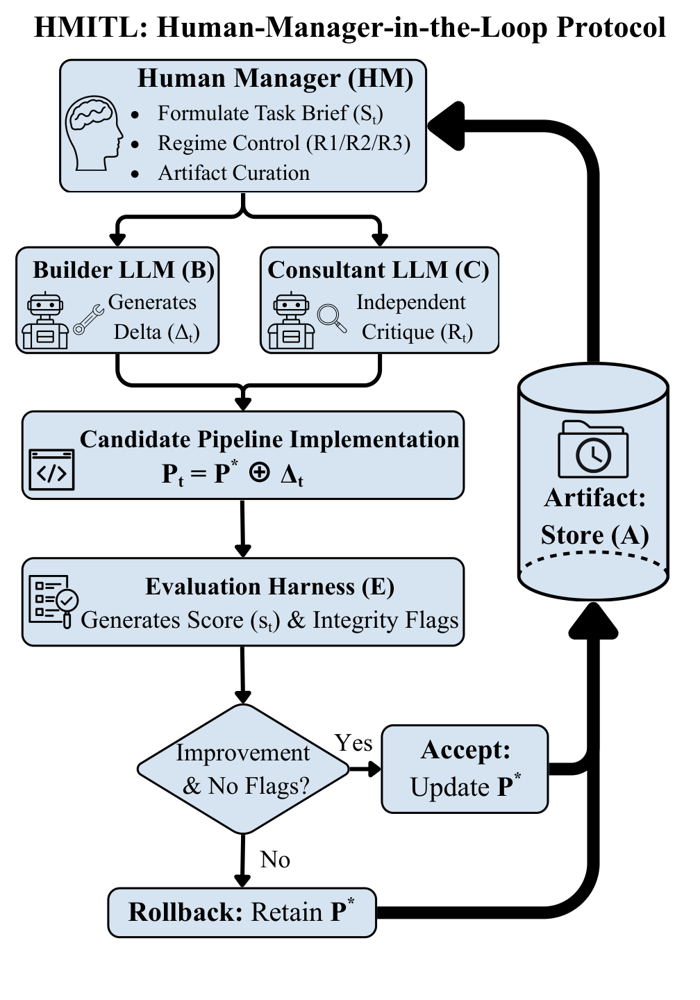

# HMITL: Manager-Governed LLM Iteration with Guardrails and Rollback for Reproducible Healthcare Machine Learning Pipelines

**Jialuo Chen · Haijing Wang · Siyu Shao**

**2026 IEEE 14th International Conference on Healthcare Informatics (ICHI)** · Pages 1218–1226

[📄 IEEE Xplore](https://ieeexplore.ieee.org/document/11634837) ·
[🔗 DOI](https://doi.org/10.1109/ICHI69079.2026.00156) ·
[💻 Code](https://github.com/chenj926/ICHI_AgentDS_clai) ·
[🤗 Dataset](https://huggingface.co/datasets/lainmn/AgentDS-Healthcare) ·
[📚 Citation](#citation)

> **TL;DR —** HMITL is a manager-governed human–LLM collaboration protocol for iterative healthcare machine learning. The human manager controls evidence admission, data-integrity guardrails, deterministic evaluation, acceptance, and rollback. We evaluate the protocol on three multimodal AgentDS-Healthcare tasks spanning structured data, clinical text, PDF receipts, and time-series records.

<p align="center">
  <a href="docs/assets/hmitl_architecture_diagram.pdf">
    
  </a>
</p>
<p align="center"><em>HMITL protocol architecture. Select the figure to open the original PDF.</em></p>

## Overview

Large language models can rapidly generate and modify machine-learning pipelines, but unconstrained iteration can introduce silent data errors, unstable feature engineering, unnecessary complexity, and performance regressions.

Human-Manager-in-the-Loop (HMITL) separates proposal generation from acceptance:

- The **Builder LLM** proposes concrete pipeline changes.
- The **Consultant LLM** provides an independent critique.
- The **Human Manager** maintains the task brief, operating regime, guardrails, and acceptance criteria.
- The **Evaluation Harness** scores every candidate and checks data-integrity constraints.
- **Acceptance and rollback** update or restore the best-known pipeline.
- The **Artifact Store** preserves decisions, metrics, and experiment traces for auditability.

This repository is the official code and reproducibility companion for our paper published at IEEE ICHI 2026.

## Key Results

| Task | Metric | Naive baseline | HMITL result | Setting |
|---|---:|---:|---:|---|
| Challenge 1 — 30-day readmission | Macro-F1 ↑ | 0.6198 | **0.9014** | Competition window |
| Challenge 2 — ED cost forecasting | MAE ↓ | 701.1945 | **447.9542** | Post-competition, official evaluation interface |
| Challenge 3 — discharge readiness | Macro-F1 ↑ | 0.4889 | **0.8408** | Controlled 15-iteration study |

For Challenge 3, multi-window arbitration with rollback achieved the highest score while also producing the smallest maximum drawdown and adjacent-iteration variance among the evaluated variants.

## Quick Start

### 1. Clone and install

```bash
git clone https://github.com/chenj926/ICHI_AgentDS_clai.git
cd ICHI_AgentDS_clai
python -m venv .venv
```

Activate the environment:

```powershell
# Windows PowerShell
.\.venv\Scripts\Activate.ps1
```

```bash
# macOS / Linux
source .venv/bin/activate
```

Then install the tested Python 3.12 environment:

```bash
python -m pip install --upgrade pip
python -m pip install -r requirements.txt
```

### 2. Configure data paths

Copy the example configuration:

```powershell
# Windows PowerShell
Copy-Item .env.example .env
```

```bash
# macOS / Linux
cp .env.example .env
```

Set `CLAI_BASE_DIR` to the folder that contains the AgentDS-Healthcare task files:

```env
CLAI_BASE_DIR=/path/to/AgentDS-Healthcare/Healthcare
```

`AGENTDS_API_KEY` and `AGENTDS_TEAM_NAME` are optional and are only needed to run the benchmark submission cells.

### 3. Run a paper entry point

| Challenge | Canonical notebook |
|---|---|
| Challenge 1 | [`agent_ds_healthcare/Challenge1_Health_Final.ipynb`](agent_ds_healthcare/Challenge1_Health_Final.ipynb) |
| Challenge 2 | [`agent_ds_healthcare/Challenge2_baseline_ichi_best.ipynb`](agent_ds_healthcare/Challenge2_baseline_ichi_best.ipynb) |
| Challenge 3 | [`agent_ds_healthcare/Challenge3_ichi_best.ipynb`](agent_ds_healthcare/Challenge3_ichi_best.ipynb) |

All three canonical notebooks use `.env` and `CLAI_BASE_DIR`; no machine-specific data path needs to be edited in the notebook.

## Reproduce the Paper

There are two reproduction paths, depending on what you want to inspect.

### A. Reproduce the final predictive pipelines

Run the three canonical notebooks above. Each notebook contains the best public pipeline for its task, its deterministic evaluation logic, and submission generation.

### B. Audit the HMITL iteration process

The repository also preserves the traces used to study the collaboration protocol:

- [`agent_ds_healthcare/ch2_artifacts/`](agent_ds_healthcare/ch2_artifacts/) contains manager decisions, optimization traces, negative controls, and iteration records.
- [`agent_ds_healthcare/ch3_artifacts/`](agent_ds_healthcare/ch3_artifacts/) contains controlled-study trajectories, rollback experiments, and per-variant evaluation traces.

These artifacts show how candidate pipelines were proposed, evaluated, accepted, or rolled back—not only the final leaderboard-facing result.

## Repository Structure

```text
.
├── agent_ds_healthcare/
│   ├── Challenge1_Health_Final.ipynb
│   ├── Challenge2_baseline_ichi_best.ipynb
│   ├── Challenge3_ichi_best.ipynb
│   ├── ch2_artifacts/
│   └── ch3_artifacts/
├── agent_ds_commerce/                 # auxiliary AgentDS work; not used by the paper
├── docs/assets/                       # HMITL architecture figure
├── .env.example
├── CITATION.cff
├── requirements.txt
└── README.md
```

Historical experiment notebooks remain under `agent_ds_healthcare/` because the paper studies the iteration process as well as the final models. The root has not been reorganized, so existing local competition-era work is unaffected.

## Data and Configuration

The raw benchmark data and receipt PDFs are not redistributed in this repository. Download them from [AgentDS-Healthcare](https://huggingface.co/datasets/lainmn/AgentDS-Healthcare):

```bash
python -m pip install --upgrade huggingface_hub hf-xet
hf download lainmn/AgentDS-Healthcare --type dataset --local-dir ./data/AgentDS-Healthcare
```

The expected data directory contains files such as:

```text
Healthcare/
├── admissions_train.csv
├── admissions_test.csv
├── discharge_notes.json
├── ed_cost_train.csv
├── ed_cost_test.csv
├── patients.csv
├── stays_train.csv
├── stays_test.csv
├── vitals_timeseries.json
└── receipts_pdf/
```

Configure the location once in `.env`:

```env
CLAI_BASE_DIR=./data/AgentDS-Healthcare/Healthcare
CLAI_RECEIPT_DIR=./data/AgentDS-Healthcare/Healthcare/receipts_pdf
AGENTDS_API_KEY=
AGENTDS_TEAM_NAME=
```

Keep your real `.env` and benchmark credentials out of version control.

## Challenge 1 — 30-Day Readmission

**Entry point:** `agent_ds_healthcare/Challenge1_Health_Final.ipynb`

- Inputs: admissions, patients, and discharge notes
- Metric: Macro-F1
- Submission columns: `admission_id,readmit_30d`

## Challenge 2 — ED Cost Forecasting

**Entry point:** `agent_ds_healthcare/Challenge2_baseline_ichi_best.ipynb`

- Inputs: ED costs, admissions, patients, and parsed receipt features
- Metric: mean absolute error (MAE)
- Submission columns: `patient_id,ed_cost_next3y_usd`

The best pipeline expects `<CLAI_BASE_DIR>/receipts_parsed.joblib`, a local cache derived from the upstream receipt PDFs. The raw PDFs may remain in `receipts_pdf/`, or `CLAI_RECEIPT_DIR` may point to another local receipt directory.

## Challenge 3 — Discharge Readiness

**Entry point:** `agent_ds_healthcare/Challenge3_ichi_best.ipynb`

- Inputs: stays, patients, and vital-sign time series
- Metric: Macro-F1
- Submission columns: `stay_id,discharge_ready_day11`

## Reproducibility Artifacts

The artifact folders preserve experiment histories rather than polished narrative documentation. They include concise prompt fragments, manager notes, metrics, controls, and partially bilingual working records. This raw form is intentional: it keeps the decision trail inspectable and distinguishes the evaluated process from a retrospective summary.

## Citation

If you use this repository, please cite the published paper:

```bibtex
@INPROCEEDINGS{11634837,
  author={Chen, Jialuo and Wang, Haijing and Shao, Siyu},
  booktitle={2026 IEEE 14th International Conference on Healthcare Informatics (ICHI)},
  title={HMITL: Manager-Governed LLM Iteration with Guardrails and Rollback for Reproducible Healthcare Machine Learning Pipelines},
  year={2026},
  volume={},
  number={},
  pages={1218-1226},
  keywords={Modeling;Medical services;Pipelines;Artificial intelligence;Machine learning;Printing;Windows;Protocols;Large language models;Collaboration;human–AI collaboration;reproducibility;large language models;multimodal healthcare data;data integrity;benchmarking},
  doi={10.1109/ICHI69079.2026.00156}
}
```

The repository also includes [`CITATION.cff`](CITATION.cff) for GitHub's **Cite this repository** interface.

## Acknowledgements

We thank the AgentDS Benchmark team for releasing the [AgentDS-Healthcare dataset](https://huggingface.co/datasets/lainmn/AgentDS-Healthcare) and challenge infrastructure that made this study possible. Please also cite the upstream benchmark and follow its license and usage terms.
